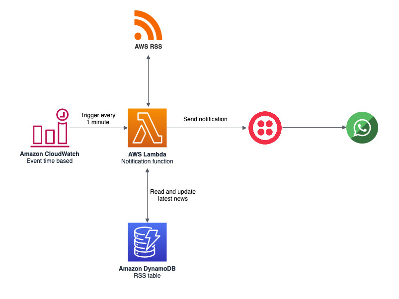

# AWS Whats New WhatsApp notifications
Are you tired to try to be updated about AWS? Would you like to be notified every time AWS launches a new feature or service? This simple app reads the AWS Whats New RSS and send you a notification via WhatsApp about the latest entry.



_pre requisites:_
* Twilio account
* AWS CLI
* AWS account with the following access:
    * AWS CloudFormation
    * Amazon Lambda
    * Amazon CloudWatch
    * Amazon DynamoDB

## Creating the resources (not yet implemented)
CloudFormation is going to create a DynamoDB table with **rss** pk, and **timest** attribute, CloudWatch trigger for **every minute** to start a notification function, and the **notification** Lambda function. Follow the steps below:

1. Download or clone the repository and copy the CloudFormation template **deploy/cf-template.yml**;
2. Open the CloudFormation console at https://console.aws.amazon.com/cloudformation
3. On the Step 1 - Specify template: Choose Upload a template file, click on Choose file button and select the **cf-template.yml**
4. On the Step 2 - Specify stack details: Enter the Stack name as **whats-new**
5. On the Step 3 - Configure stack options: Just click on Next button
6. click on Create Stack button
7. Wait for the stack get into status **CREATE_COMPLETE**

## Testing locally
Run the following commands:
```
    virtualenv notificationsenv
    source notificationsenv/bin/activate
    pip install -r requirements.txt
    python whatsapp_messaging.py
```

## Deploying function to AWS
Run the following commands:
```
    deactivate
    ./deploy/deploy.sh
```

## Reference links
* https://aws.amazon.com/new/
* https://www.twilio.com/whatsapp

## License summary
This sample code is made available under the MIT-0 license. See the LICENSE file.
